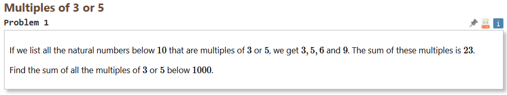

# Problem 1
https://projecteuler.net/problem=1

## Date
Fri 20/9/24

## Statement

## Discussion
Let’s first observe that the desired sum is no greater than the sum of ALL integers from 1 to 1000. This itself is no greater than a million, so we can just use ordinary Java integers.

The real question is – can we do it a clever way, or is the only way forward just to loop, check and add? Well let’s try, at least. We have the baby example to help.

First, notice that we can enforce a strict partition of integers into:
A.	Multiples of 15
B.	Multiples of 5 but not 3
C.	Multiples of 3 but not 5
D.	Multiples of neither

We wish to sum up A, B and C. Observe that simply summing up multiples of 5 covers precisely A and B; multiples of 3 cover A and C. Hence if we sum up the 5-multiples together with the 3-multiples, we will have included exactly two copies of A. So, the solution should come from summing up 5-multiples and 3-multiples, then subtracting 15-multiples.

As to how to do these summings-up quickly? Observe that x + 2x + 3x + … + nx = x(1+2+3+…+n) = xn(n+1)/2

I.e., obtain n by integer-division by x (our choice of multiple). Then take the nth triangular number. Then multiply back up by x.

Let f(N,x) = xn(n+1)/2, where n = floor(N/x)

Then our answer for arbitrary N is f(N,3) + f(N,5) - f(N,15)

Let’s verify this for the baby example: floor(9/3) = 3; floor(9/5) = 1; floor(9/15) = 0

Answer =
   3 * 3 * (3+1)/2
+ 5 * 1 * (1+1)/2
- 15 * 0 * (0+1)/2

= 18 + 5 - 0 = 23

Good!

## Code
[Problem0001.java]

## Output
Test answer: 23

Real answer: 233168

## Check
